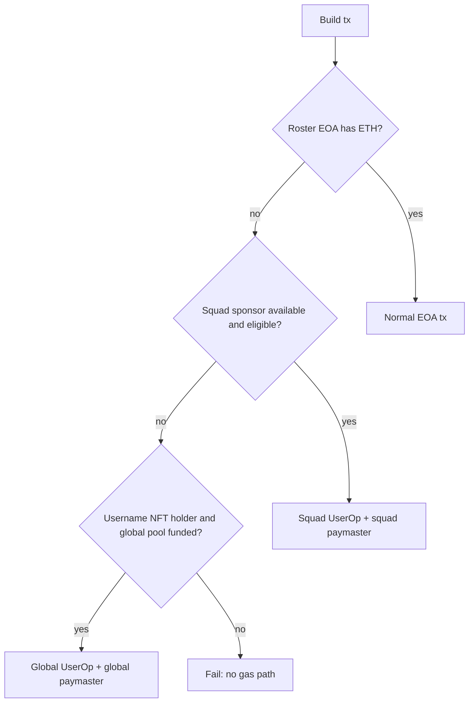

# pacto-username-nft — Desktop Client Integration

Normative guide for [pacto-app](https://github.com/covenant-gov/pacto-app) integration with username NFT + global fallback sponsorship.

**Canonical contracts:** this repo (`covenant-gov/pacto-username-nft`).  
**Transport:** same ERC-4337 / EIP-7702 stack as [pacto-squad-sponsor](https://github.com/covenant-gov/pacto-app/blob/main/docs/wallet/PACTO_SQUAD_SPONSOR.md).

---

## 1. Address book

After deploy, pin addresses from `deployments/<chainId>/full-system.json` into pacto-app `pacto-protocol-addresses.json`:

```json
{
  "networks": {
    "sepolia": {
      "globalUsernameSponsor": {
        "usernameSystemFactory": "0x…",
        "pactoUsernameNft": "0x…",
        "globalSponsorPool": "0x…",
        "sponsorPolicyRegistry": "0x…",
        "pactoGlobalPaymaster": "0x…",
        "policyVersion": 1,
        "allowed7702Implementation": "0x33F920B5aF6c527f63BD6B24d58Dccd698b2DC60",
        "entryPoint": "0x0000000071727De22E5E9d8BAf0edAc6f37da032"
      }
    }
  }
}
```

Re-read `policyVersion` on-chain (`SponsorPolicyRegistry.policyVersion()`) when registering new actions.

---

## 2. Sponsor path selection

For any on-chain write, choose path in order:



**Global path requirements:**

- `PactoUsernameNFT.eligibleMember(rosterEvm)` returns non-zero `(npubHash, tokenId)`.
- `GlobalSponsorPool.spendablePoolWei()` sufficient (paymaster checks 115% headroom).
- Target + selector allowed by `SponsorPolicyRegistry` (or custom policy in payload).
- Bundler configured (Pimlico / `BUNDLER_RPC_URL`).

**Prefer squad sponsor** when both paths work — global pool is shared protocol float.

---

## 3. Global `paymasterAndData` encoding (v1)

Layout matches squad sponsor header + custom payload:

| Offset | Field | Size |
|--------|-------|------|
| 0 | paymaster address | 20 bytes |
| 20 | paymasterVerificationGasLimit | 16 bytes |
| 36 | paymasterPostOpGasLimit | 16 bytes |
| 52 | payload | ABI-encoded |

**Payload:**

```typescript
// version = 1
const payload = abi.encode(
  ['uint8', 'bytes32', 'address', 'address'],
  [1, npubHash, member, policyAddress] // policyAddress = 0x0 → default registry
);
const paymasterAndData = concat([header, payload]);
```

**Account calldata:** must decode as `execute(address,uint256,bytes)` with selector `0xb61d27f6`. Inner `(target, innerCallData)` is what policy checks.

Golden vectors: add under `src/lib/evm/sponsor/` (mirror squad sponsor fixtures).

---

## 4. Username claim UX

### Preclaim validation (client)

- Name: lowercase `[a-z]`, length 3–32.
- `PactoUsernameNFT.nameAvailable(name)`.
- User has not already claimed (`npubOf(evmAddress) == 0`).

### Dual attestation

Follow [EVM↔Nostr identity link](https://github.com/daopunk/nostr-evm-yield-distributor-tech-spec/blob/main/03-EVM-2-NOSTR.md):

1. Build binding `{ npubHash, evmAddress, name, nonce, issuedAt }`.
2. Sign with Nostr key → publish link event to relays.
3. Sign EIP-712 `ClaimBinding` with EVM key (domain `PactoUsername`, contract = NFT address).
4. Call `claim(name, npubHash, nonce, issuedAt, evmSig)` with `msg.value >= mintFee`.

Use `PactoUsernameNFT.hashClaimBinding(...)` for digest parity.

### First claim gas

Chicken-and-egg: user may have no NFT yet. Options:

- User pays gas from EOA for first claim, or
- Global sponsor if policy allows `PactoUsernameNFT` and pool is funded (deploy seeds contract-wide allow).

---

## 5. Verified checkmark resolution

```typescript
async function isVerifiedUsername(npub: string, evmAddress: Address): Promise<boolean> {
  const npubHash = sha256(npubBytes); // match client npub hashing convention
  const nostrOk = await verifyNostrLinkEvent(npub, evmAddress); // cached relay event
  const record = await nft.recordOf(npubHash);
  return (
    nostrOk &&
    record.evmAddress.toLowerCase() === evmAddress.toLowerCase() &&
    record.name.length > 0
  );
}
```

**Pending transfer UI:** if `isPendingTransfer(npubHash)`, show “transfer pending” — sponsorship still follows current `evmAddress`, not `pendingAddress`.

---

## 6. EVM address rotation UX

1. Current wallet calls `initiateAddressTransfer(npubHash, newAddress)`.
2. New wallet calls `claimAddressTransfer(npubHash)`.
3. Optional: publish updated Nostr link event; optional `cancelAddressTransfer` on typo.

After claim: refresh `npubOf` mappings and NFT `ownerOf(tokenId)`.

---

## 7. Action catalog (off-chain)

Maintain `src/lib/evm/sponsor/pacto_actions.ts` mapping app flows → `(target, selector)`:

| Flow | Target | Notes |
|------|--------|-------|
| Claim username | `pactoUsernameNft` | `claim(...)` |
| Initiate / claim / cancel address transfer | `pactoUsernameNft` | rotation selectors |
| SquadAdmin bootstrap | pacto-gov factories | register via policy admin |
| SquadAdmin writes | clone address | `registerTarget(clone)` post-deploy |

Before building a global UserOp, assert local catalog version ≥ on-chain `policyVersion`.

---

## 8. Bundler & 7702

Same as squad sponsor:

- EntryPoint v0.7: `0x0000000071727De22E5E9d8BAf0edAc6f37da032`
- Pimlico-first bundler; not Alchemy AA bundler
- EIP-7702 set-code to `allowed7702Implementation` when roster EOA has empty code
- Bare ECDSA over `userOpHash` (65 bytes); nonce key `0`

See [PACTO_SQUAD_SPONSOR.md](https://github.com/covenant-gov/pacto-app/blob/main/docs/wallet/PACTO_SQUAD_SPONSOR.md) for gas estimation margins and error codes.

---

## 9. Rust / Alloy bindings (proposed)

| Concern | Location in pacto-app |
|---------|----------------------|
| Contract bindings | `src-tauri/src/evm/contracts/pacto_username/` |
| Global UserOp builder | extend `sponsor_userop.rs` or new `global_sponsor_userop.rs` |
| Path selection | `sponsor_path.rs` called from `gov_module_write.rs` |
| Username claim | profile settings + new Tauri commands |
| Persistence | SQLite: claimed username, npubHash, tokenId, policyVersion cache |

---

## 10. Operator smoke (post-deploy)

1. Deploy: `pnpm deploy:sepolia` → verify `deployments/11155111/full-system.json`.
2. Fund paymaster: `pnpm fund:paymaster:sepolia`.
3. Fund pool: `cast send $POOL "deposit()" --value 1ether …`
4. Claim username on Sepolia; verify badge + global sponsored write to allowed target.

---

## Related

- [TECH_SPEC.md](./TECH_SPEC.md)
- [PACTO_APP_FOLLOWUPS.md](./PACTO_APP_FOLLOWUPS.md)
