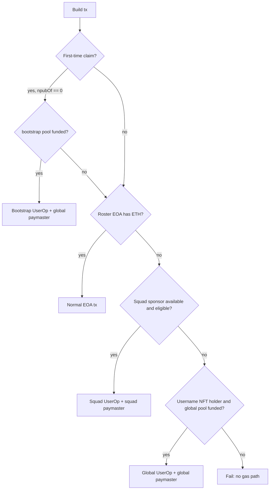

# pacto-username-nft — Desktop Client Integration

Normative guide for [pacto-app](https://github.com/covenant-gov/pacto-app) integration with username NFT + global fallback sponsorship + bootstrap mint.

**Canonical contracts:** this repo (`covenant-gov/pacto-username-nft`).  
**Transport:** same ERC-4337 / EIP-7702 stack as [pacto-squad-sponsor](https://github.com/covenant-gov/pacto-app/blob/main/docs/wallet/PACTO_SQUAD_SPONSOR.md).

---

## 1. Address book

After deploy, pin addresses from `deployments/<chainId>/full-system.json` into pacto-app `pacto-protocol-addresses.json`:

```json
{
  "networks": {
    "sepolia": {
      "globalUsernameSponsor": {
        "protocolRegistry": "0x…",
        "usernameSystemFactory": "0x…",
        "pactoUsernameNft": "0x…",
        "globalSponsorPool": "0x…",
        "bootstrapMintPool": "0x…",
        "sponsorPolicyRegistry": "0x…",
        "bootstrapClaimPolicy": "0x…",
        "pactoGlobalPaymaster": "0x…",
        "policyVersion": 3,
        "allowed7702Implementation": "0x33F920B5aF6c527f63BD6B24d58Dccd698b2DC60",
        "entryPoint": "0x0000000071727De22E5E9d8BAf0edAc6f37da032"
      }
    }
  }
}
```

Re-read `policyVersion` on-chain (`SponsorPolicyRegistry.policyVersion()`) when registering new member actions.

---

## 2. Sponsor path selection

For any on-chain write, choose path in order:



**Bootstrap path requirements** (one-time `claim()` only):

- `PactoUsernameNFT.npubOf(rosterEvm) == 0`.
- `canBootstrapClaim(rosterEvm, npubHash)` and `nameAvailable(name)`.
- `BootstrapMintPool.spendablePoolWei()` sufficient (paymaster checks 115% headroom).
- UserOp inner call is `claim(...)` with `execute` value `0`.
- Payload `npubHash` matches calldata `npubHash`.
- Bundler configured (Pimlico / `BUNDLER_RPC_URL`).

**Global member path requirements** (post-mint actions):

- `PactoUsernameNFT.eligibleMember(rosterEvm)` returns non-zero `(npubHash, tokenId)`.
- `GlobalSponsorPool.spendablePoolWei()` sufficient.
- Target + selector allowed by `SponsorPolicyRegistry`.
- **`policy` in paymaster payload MUST be `address(0)`** — custom policies are rejected on the member path.
- Bundler configured.

**Prefer squad sponsor** when both squad and global member paths work — global pool is shared protocol float.

---

## 3. Global `paymasterAndData` encoding (v1)

Layout matches squad sponsor header + custom payload:

| Offset | Field | Size |
|--------|-------|------|
| 0 | paymaster address | 20 bytes |
| 20 | paymasterVerificationGasLimit | 16 bytes |
| 36 | paymasterPostOpGasLimit | 16 bytes |
| 52 | payload | ABI-encoded |

**Payload:**

```typescript
// version = 1
const payload = abi.encode(
  ['uint8', 'bytes32', 'address', 'address'],
  [1, npubHash, member, policyAddress] // member path: policyAddress = 0x0 only
);
const paymasterAndData = concat([header, payload]);
```

**Account calldata:** must decode as `execute(address,uint256,bytes)` with selector `0xb61d27f6`. Inner `(target, value, innerCallData)` is what policy checks. Bootstrap `claim()` requires `value == 0`.

The paymaster routes to bootstrap vs member lane based on `npubOf(member)` — clients do not pass a lane flag.

Golden vectors: add under `src/lib/evm/sponsor/` (mirror `test/fixtures/claim-link.golden.json` in this repo).

---

## 4. Username claim UX

### Two-layer Nostr model

| Layer | Responsibility | Used for |
|-------|----------------|----------|
| **Relay event** (kind `31337`) | Social commit, badge cache | UX, verified checkmark pre-check |
| **Struct hash** (`PactoNostrClaim`) | On-chain BIP-340 verify | Mint authorization |

Relay and chain use the **same field tuple** but the contract verifies the compact struct hash, not NIP-01 JSON.

### Preclaim validation (client)

- Name: any string accepted by NIP-01 kind 0 `name` (no on-chain charset/length rules).
- `PactoUsernameNFT.nameAvailable(name)` (unclaimed and not reserved).
- Prefer reading the live NFT from `PactoProtocolRegistry.usernameNft()` over a stale address book.
- `npubOf(evmAddress) == 0` and `canBootstrapClaim(evmAddress, npubHash)`.
- `BootstrapMintPool.spendablePoolWei()` > 0 (if using bootstrap path).

### Dual attestation (sign both digests)

Shared binding tuple: `(pubkey, npubHash, evmAddress, name, nonce, issuedAt, salt)`.

1. Generate random `salt` (32 bytes).
2. Compute Nostr digest — must match `NostrClaimLink.hashNostrClaim(pubkey, evmAddress, name, nonce, issuedAt, salt)`:

   ```
   typehash = keccak256("PactoNostrClaim(bytes32 pubkey,address evmAddress,bytes32 nameHash,uint256 nonce,uint256 issuedAt,bytes32 salt)")
   digest = keccak256(abi.encode(typehash, pubkey, evmAddress, keccak256(name), nonce, issuedAt, salt))
   ```

3. **Commit:** publish Nostr link event to relays (kind `31337`, same tags/fields).
4. **Nostr sign:** BIP-340 Schnorr over `digest` → 64-byte `nostrSignature`.
5. **EVM sign:** EIP-712 `ClaimBinding` v2 (domain `PactoUsername`, version **`2`**, contract = NFT address):

   ```
   ClaimBinding(bytes32 npubHash,address evmAddress,string name,uint256 nonce,uint256 issuedAt,bytes32 salt)
   ```

   Use `PactoUsernameNFT.hashClaimBinding(...)` for digest parity → 65-byte `evmSignature`.

6. Build UserOp: `execute(nft, 0, claim(name, npubHash, pubkey, nonce, issuedAt, salt, nostrSig, evmSig))`.
7. After mint: all future writes use **member** sponsor path (`eligibleMember != 0`).

### First claim gas

Bootstrap path resolves the chicken-and-egg problem: new users with no ETH and no NFT can mint via EIP-7702 + ERC-4337 with gas from `BootstrapMintPool`. Ops funds the bootstrap pool separately from the global member pool.

---

## 5. Verified checkmark resolution

```typescript
async function isVerifiedUsername(npub: string, evmAddress: Address): Promise<boolean> {
  const npubHash = sha256(concat([0x02, pubkeyBytes])); // match NostrClaimLink.npubHashFromPubkey
  const nostrOk = await verifyNostrLinkEvent(npub, evmAddress); // cached relay event (layer 1)
  const record = await nft.recordOf(npubHash);
  return (
    nostrOk &&
    record.evmAddress.toLowerCase() === evmAddress.toLowerCase() &&
    record.name.length > 0
  );
}
```

Badge requires **both** relay link event (social) **and** on-chain record (cryptographic). Mint trusts struct hash + EIP-712 only.

**Pending transfer UI:** if `isPendingTransfer(npubHash)`, show “transfer pending” — sponsorship still follows current `evmAddress`, not `pendingAddress`.

---

## 6. EVM address rotation UX

1. Current wallet calls `initiateAddressTransfer(npubHash, newAddress)`.
2. New wallet calls `claimAddressTransfer(npubHash)`.
3. Optional: publish updated Nostr link event; optional `cancelAddressTransfer` on typo.

After claim: refresh `npubOf` mappings and NFT `ownerOf(tokenId)`.

---

## 7. Action catalog (off-chain)

Maintain `src/lib/evm/sponsor/pacto_actions.ts` mapping app flows → `(target, selector)`:

| Flow | Target | Sponsor lane | Notes |
|------|--------|--------------|-------|
| Claim username | `pactoUsernameNft` | **Bootstrap** | `claim(...)` — not on member registry |
| Initiate / claim / cancel address transfer | `pactoUsernameNft` | Member | rotation selectors seeded at deploy |
| SquadAdmin bootstrap | pacto-gov factories | Member | register via policy admin |
| SquadAdmin writes | clone address | Member | `registerTarget(clone)` post-deploy |

Before building a global UserOp, assert local catalog version ≥ on-chain `policyVersion`.

---

## 8. Bundler & 7702

Same as squad sponsor:

- EntryPoint v0.7: `0x0000000071727De22E5E9d8BAf0edAc6f37da032`
- Pimlico-first bundler; not Alchemy AA bundler
- EIP-7702 set-code to `allowed7702Implementation` when roster EOA has empty code
- Bare ECDSA over `userOpHash` (65 bytes); nonce key `0`

See [PACTO_SQUAD_SPONSOR.md](https://github.com/covenant-gov/pacto-app/blob/main/docs/wallet/PACTO_SQUAD_SPONSOR.md) for gas estimation margins and error codes.

EIP-7702 **activation** gas is funded separately by ops — not from bootstrap or global pools.

**Empty bundler `reason: 0x` after L1 OK is not “transport only.”** L1 `eth_call` of bare `claim(...)` does not wrap `execute` and does not run paymaster validation. Pimlico `eth_estimateUserOperationGas` also simulates account + paymaster. `PactoGlobalPaymaster` reverts with typed selectors on product rejects (pool headroom, wrong NFT target vs `REGISTRY.usernameNft()`, claim payload mismatch, policy deny, bad 7702 impl, etc.). Decode the 4-byte selector before blaming shared 7702 helpers.

---

## 9. Rust / Alloy bindings (proposed)

| Concern | Location in pacto-app |
|---------|----------------------|
| Contract bindings | `src-tauri/src/evm/contracts/pacto_username/` |
| Global UserOp builder | extend `sponsor_userop.rs` or new `global_sponsor_userop.rs` |
| Path selection | `sponsor_path.rs` — EOA → squad → global member; bootstrap for first claim |
| `hashNostrClaim` encoder | shared TS/Rust helper matching `NostrClaimLink` |
| Username claim | profile settings + new Tauri commands |
| Persistence | SQLite: claimed username, npubHash, tokenId, policyVersion cache |

---

## 10. Operator smoke (post-deploy)

1. Deploy: `pnpm deploy:sepolia` → verify `deployments/11155111/full-system.json`.
2. Fund paymaster: `pnpm fund:paymaster:sepolia`.
3. Fund pools:
   ```bash
   cast send $GLOBAL_POOL "deposit()" --value 1ether …
   cast send $BOOTSTRAP_POOL "deposit()" --value 1ether …
   ```
4. Bootstrap claim username on Sepolia via sponsored UserOp; verify badge + global sponsored rotation write.

---

## Related

- [TECH_SPEC.md](./TECH_SPEC.md)
- [PACTO_APP_FOLLOWUPS.md](./PACTO_APP_FOLLOWUPS.md)
