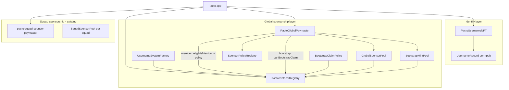

# Pacto Username NFT — Technical Specification

**Status:** v2 (bootstrap mint + dual-path paymaster)  
**Repo:** [covenant-gov/pacto-username-nft](https://github.com/covenant-gov/pacto-username-nft)  
**Companion repos:** [pacto-app](https://github.com/covenant-gov/pacto-app), [pacto-squad-sponsor](https://github.com/covenant-gov/pacto-squad-sponsor), [pacto-gov](https://github.com/covenant-gov/pacto-gov)  
**Target chains (v1):** Ethereum Mainnet (`1`), Sepolia (`11155111`), Arbitrum One (`42161`)  
**Solidity:** `0.8.30`  
**License:** MIT

---

## 1. Purpose

Pacto users claim a **unique username** tied to their **Nostr npub** and **EVM address**. That credential unlocks:

1. **Verified identity** — checkmark in the app when Nostr + on-chain record align.
2. **Global gas sponsorship** — fallback paymaster for Pacto app on-chain actions when squad sponsorship is unavailable.
3. **Bootstrap mint sponsorship** — one-time sponsored `claim()` for new users with no ETH and no NFT yet.

Sponsorship pays **gas only**. Action permission stays in target contracts (pacto-gov, SquadAdmin, etc.).

---

## 2. Architecture



### Three paymaster paths (client-side)

| Path | When | Pool | Policy |
|------|------|------|--------|
| **Squad sponsor** (primary) | Member eligible + squad pool funded | Per-squad `SquadSponsorPool` | Squad policy |
| **Global member** (fallback) | Username NFT holder + global pool funded | `GlobalSponsorPool` | `SponsorPolicyRegistry` only |
| **Bootstrap mint** (one-time) | `npubOf(member) == 0`, bootstrap pool funded | `BootstrapMintPool` | Fixed `BootstrapClaimPolicy` |

Order: **EOA ETH** → **squad sponsor** → **global member** (post-mint). **Bootstrap mint** applies only to the first `claim()` when the user has no NFT.

---

## 3. Contracts

| Contract | Role |
|----------|------|
| `PactoProtocolRegistry` | Mutable alpha address book; owner updates NFT/paymaster/pools/policies |
| `PactoUsernameNFT` | ERC-721 username + npub-keyed `UsernameRecord`; dual-sig claim; 2-step EVM rotation |
| `GlobalSponsorPool` | Protocol-wide ETH vault for member actions; pro-rata shares; `spendGas` only from registry paymaster |
| `BootstrapMintPool` | Separate ETH vault for one-time bootstrap `claim()` gas |
| `SponsorPolicyRegistry` | Deny-by-default allowlist for **member** sponsorship (rotation selectors + app targets) |
| `BootstrapClaimPolicy` | Fixed policy: `claim()` only, pre-claim checks, `execute` value == 0 |
| `PactoGlobalPaymaster` | ERC-4337 EntryPoint v0.7; dual-path validation; routes billing to correct pool |
| `UsernameSystemFactory` | Chain singleton; deploys and initializes the registry + system |
| `NostrClaimLink` | Compact `PactoNostrClaim` struct hash + BIP-340 verify (~15–25k gas) |
| `Bip340` | On-chain Schnorr verifier for Nostr signatures |

---

## 4. Identity: `UsernameRecord`

One **npub hash → one record**:

```solidity
struct UsernameRecord {
  string name;            // immutable after claim; any string (NIP-01 kind 0 style); unique on this NFT
  address evmAddress;     // active controller; eligible for sponsorship
  address pendingAddress; // non-zero during 2-step transfer
  uint256 tokenId;        // linked ERC-721
}
```

**Invariants:**

- One npub, one name, one active `evmAddress` at a time.
- `npubHash` and `name` are fixed after claim.
- Standard ERC-721 `transferFrom` is **disabled**; use `initiateAddressTransfer` / `claimAddressTransfer`.
- During pending transfer, **old** `evmAddress` retains sponsorship until claim completes.

### Claim flow (dual attestation, 1-tx reveal)

**Two-layer Nostr model:**

| Layer | Where | Purpose |
|-------|-------|---------|
| **Social commit** | Nostr relays (kind `31337`) | Public intent, badge cache, UX |
| **Cryptographic reveal** | On-chain `claim()` | Mint authorization via compact struct hash |

The chain does **not** parse or hash NIP-01 JSON (~100k gas avoided). On-chain verification uses a compact `PactoNostrClaim` struct hash signed with BIP-340.

**Steps:**

1. Client generates `salt` and builds binding tuple `(pubkey, evmAddress, name, nonce, issuedAt, salt)`.
2. **Commit (off-chain):** publish Nostr link event to relays (same field tuple — badge layer).
3. **Sign Nostr:** BIP-340 Schnorr over `hashNostrClaim(pubkey, evmAddress, name, nonce, issuedAt, salt)`.
4. **Sign EVM:** EIP-712 `ClaimBinding` v2 over `(npubHash, evmAddress, name, nonce, issuedAt, salt)`.
5. **Reveal (on-chain):** single sponsored or paid UserOp calling:

```solidity
claim(
  string name,
  bytes32 npubHash,
  bytes32 pubkey,
  uint256 nonce,
  uint256 issuedAt,
  bytes32 salt,
  bytes nostrSignature,  // 64-byte BIP-340
  bytes evmSignature     // 65-byte ECDSA
)
```

**On-chain checks:** npubHash matches pubkey, `issuedAt` window (`MAX_BINDING_AGE = 7 days`, `CLOCK_SKEW = 5 minutes`), per-npub nonce, Nostr sig, EIP-712 sig, name availability, reserved names.

**EIP-712 domain:** `PactoUsername` / version **`2`** / verifyingContract = `PactoUsernameNFT`.

**Type:** `ClaimBinding(bytes32 npubHash,address evmAddress,string name,uint256 nonce,uint256 issuedAt,bytes32 salt)`

**Nostr struct type:** `PactoNostrClaim(bytes32 pubkey,address evmAddress,bytes32 nameHash,uint256 nonce,uint256 issuedAt,bytes32 salt)`

**npub hash:** `sha256(0x02 || pubkey)` — matches bech32 npub decoded bytes.

### EVM address rotation (2-step)

| Step | Function | Caller |
|------|----------|--------|
| 1 | `initiateAddressTransfer(npubHash, newAddress)` | current `evmAddress` |
| 2 | `claimAddressTransfer(npubHash)` | `pendingAddress` |
| cancel | `cancelAddressTransfer(npubHash)` | current `evmAddress` |

Deploy seeds these three selectors on `SponsorPolicyRegistry` for member sponsorship. **`claim()` is not registered** on the member registry — bootstrap uses `BootstrapClaimPolicy` only.

### Verified badge (client)

Show checkmark only when **all** hold:

- Nostr link event verifies for `(npub, evmAddress)` (relay layer).
- On-chain record exists with matching `name`, `evmAddress`, `npubHash`.
- `recordOf(npubHash).evmAddress == evmAddress`.

---

## 5. Global sponsorship

### Paymaster dual-path validation

Routing key: `PactoUsernameNFT.npubOf(member)`.

**Bootstrap path** (`npubOf == 0`):

1. Bootstrap pool headroom (115% of `maxCost`).
2. Member binding (EOA or EIP-7702).
3. `execute` value == 0.
4. Payload `npubHash` matches decoded `claim()` calldata.
5. `BootstrapClaimPolicy.isSponsorable(...)`.
6. PostOp bills `BootstrapMintPool`.

**Member path** (`npubOf != 0`):

1. Global pool headroom (115% of `maxCost`).
2. Member binding.
3. **`policy` in payload must be `address(0)`** — custom policy injection rejected.
4. `eligibleMember(member)` returns matching `(npubHash, tokenId)`.
5. `SponsorPolicyRegistry.isSponsorable(...)`.
6. PostOp bills `GlobalSponsorPool`.

Additional checks: EIP-7702 member binding (same as [pacto-squad-sponsor](https://github.com/covenant-gov/pacto-squad-sponsor)).

### Policy registry (member path only)

- **Default deny.** Owner registers `registerTarget(address)` or `registerSelector(address, bytes4)`.
- `policyVersion` increments on each change; clients sync via address book.
- Deploy seeds **rotation selectors only** on `PactoUsernameNFT` when deployer == protocol owner:
  - `initiateAddressTransfer(bytes32,address)` — `0xa4df29b5`
  - `claimAddressTransfer(bytes32)` — `0xbf010955`
  - `cancelAddressTransfer(bytes32)` — `0xd88208dc`

**Modularity:** new Pacto app actions = registry update + client catalog entry. No paymaster redeploy.

### `paymasterAndData` layout (v1)

After ERC-4337 52-byte header:

```solidity
abi.encode(uint8 version, bytes32 npubHash, address member, address policy)
// version = 1
// member path: policy MUST be address(0) → SponsorPolicyRegistry
// bootstrap path: policy field ignored; fixed BootstrapClaimPolicy used internally
```

Account calldata must be `execute(target, value, innerCallData)` (`0xb61d27f6`). Bootstrap path requires `value == 0`.

PostOp context: `0x00` → bootstrap pool, `0x01` → global pool.

---

## 6. Locked decisions

| # | Decision |
|---|----------|
| D1 | Username NFT is the **membership credential**; policy registry defines **what** member actions get sponsored |
| D2 | Squad sponsor **preferred** when available and funded |
| D3 | Global pool is protocol-funded; bootstrap pool is separate ops-funded float |
| D4 | Permissions ≠ gas (unchanged from squad sponsor) |
| D5 | EntryPoint v0.7 + Pimlico bundler + PactoSimple7702Account (shared with squad sponsor) |
| D6 | Deployment JSON written **only** on `--broadcast` / resume, not dry-run simulations |
| D7 | Name: any string (aligned with NIP-01 kind 0 `name`); uniqueness + reserved names only on this NFT |
| D8 | `mintFee` configurable; default `0` |
| D9 | On-chain Nostr verify uses compact struct hash, not NIP-01 JSON |
| D10 | Member path rejects custom `policy` addresses (closes pool-drain vector) |
| D11 | EIP-7702 activation gas is ops/client concern, out of bootstrap pool scope |
| D12 | Alpha: live contracts resolve addresses from `PactoProtocolRegistry` (mutable); lock down post-alpha |

---

## 7. Deploy & ops

See [README](../README.md). Artifacts: `deployments/<chainId>/full-system.json` (broadcast only).

**JSON fields:**

```json
{
  "chainId": 11155111,
  "entryPoint": "0x0000000071727De22E5E9d8BAf0edAc6f37da032",
  "allowed7702Implementation": "0x…",
  "protocolRegistry": "0x…",
  "usernameSystemFactory": "0x…",
  "pactoUsernameNft": "0x…",
  "globalSponsorPool": "0x…",
  "bootstrapMintPool": "0x…",
  "sponsorPolicyRegistry": "0x…",
  "bootstrapClaimPolicy": "0x…",
  "pactoGlobalPaymaster": "0x…",
  "policyVersion": 3,
  "deployer": "0x…"
}
```

Post-deploy ops (Sepolia example):

```bash
pnpm fund:paymaster:sepolia   # EP deposit + FCFS stake
```

Alpha NFT upgrade (no claim migration):

```bash
pnpm deploy:nft:sepolia        # writes deployments/<chainId>/username-nft.json
pnpm update:registry:sepolia   # points registry at new NFT; reseeds rotation selectors when owner==deployer
```

EIP-7702 allowlist (UN-1 / [pacto-aa#1](https://github.com/covenant-gov/pacto-aa/issues/1)):

```bash
# Place pacto-aa deployments/11155111/eip7702-account.json under deployments/<chainId>/
# (vendored in-repo for Sepolia: 0x2E9156deE65d7946305C334824e2648Ff9128f45)
pnpm update:registry:sepolia   # sets Allowed7702 from artifact (or ALLOWED_7702 env)
# Do NOT pnpm deploy:sepolia — live protocolRegistry must stay for squad SS-3
```

Optional SponsorPolicyRegistry swap (Ownable2Step; no full-system redeploy):

```bash
pnpm deploy:policy:sepolia     # writes deployments/<chainId>/sponsor-policy-registry.json
pnpm update:registry:sepolia   # points registry.policy at new SPR; reseeds rotation selectors when owner==deployer
```

Fund pools separately:

```bash
cast send $GLOBAL_POOL "deposit()" --value 1ether …   # member actions
cast send $BOOTSTRAP_POOL "deposit()" --value 1ether …   # bootstrap mints
```

Golden test vectors: `test/fixtures/claim-link.golden.json`, `test/fixtures/generate-vectors.mjs`.

---

## 8. Related docs

- Client integration: [DESKTOP_CLIENT_INTEGRATION.md](./DESKTOP_CLIENT_INTEGRATION.md)
- pacto-app tasks: [PACTO_APP_FOLLOWUPS.md](./PACTO_APP_FOLLOWUPS.md)
- Squad sponsor (primary path): [pacto-squad-sponsor](https://github.com/covenant-gov/pacto-squad-sponsor)
