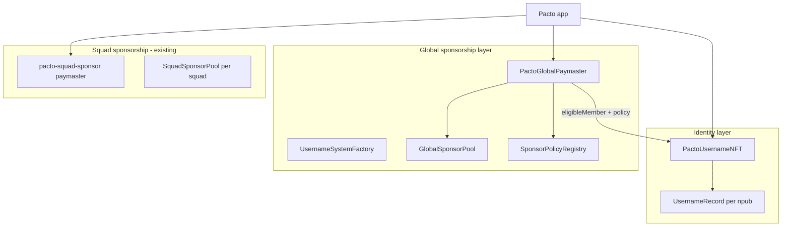

# Pacto Username NFT — Technical Specification

**Status:** v1 (implemented)  
**Repo:** [covenant-gov/pacto-username-nft](https://github.com/covenant-gov/pacto-username-nft)  
**Companion repos:** [pacto-app](https://github.com/covenant-gov/pacto-app), [pacto-squad-sponsor](https://github.com/covenant-gov/pacto-squad-sponsor), [pacto-gov](https://github.com/covenant-gov/pacto-gov)  
**Target chains (v1):** Ethereum Mainnet (`1`), Sepolia (`11155111`), Arbitrum One (`42161`)  
**Solidity:** `0.8.30`  
**License:** MIT

---

## 1. Purpose

Pacto users claim a **unique lowercase username** tied to their **Nostr npub** and **EVM address**. That credential unlocks:

1. **Verified identity** — checkmark in the app when Nostr + on-chain record align.
2. **Global gas sponsorship** — fallback paymaster for Pacto app on-chain actions when squad sponsorship is unavailable.

Sponsorship pays **gas only**. Action permission stays in target contracts (pacto-gov, SquadAdmin, etc.).

---

## 2. Architecture



### Two paymaster paths (client-side)

| Path | When | Pool |
|------|------|------|
| **Squad sponsor** (primary) | Member eligible + squad pool funded | Per-squad `SquadSponsorPool` |
| **Global sponsor** (fallback) | Username NFT holder + global pool funded + policy allows call | `GlobalSponsorPool` |

Order: **EOA ETH** → **squad sponsor** → **global sponsor**.

---

## 3. Contracts

| Contract | Role |
|----------|------|
| `PactoUsernameNFT` | ERC-721 username + npub-keyed `UsernameRecord`; EIP-712 claim; 2-step EVM rotation |
| `GlobalSponsorPool` | Protocol-wide ETH vault; pro-rata shares; `spendGas` only from paymaster |
| `SponsorPolicyRegistry` | Deny-by-default allowlist of sponsorable targets/selectors |
| `PactoGlobalPaymaster` | ERC-4337 EntryPoint v0.7; NFT eligibility + policy gate |
| `UsernameSystemFactory` | Chain singleton; deploys and wires all of the above |

---

## 4. Identity: `UsernameRecord`

One **npub hash → one record**:

```solidity
struct UsernameRecord {
  string name;            // immutable after claim; lowercase [a-z], 3–32 chars
  address evmAddress;     // active controller; eligible for sponsorship
  address pendingAddress; // non-zero during 2-step transfer
  uint256 tokenId;        // linked ERC-721
}
```

**Invariants:**

- One npub, one name, one active `evmAddress` at a time.
- `npubHash` and `name` are fixed after claim.
- Standard ERC-721 `transferFrom` is **disabled**; use `initiateAddressTransfer` / `claimAddressTransfer`.
- During pending transfer, **old** `evmAddress` retains sponsorship until claim completes.

### Claim flow

1. Off-chain: dual-signed binding ([EVM↔Nostr spec](https://github.com/daopunk/nostr-evm-yield-distributor-tech-spec/blob/main/03-EVM-2-NOSTR.md)) — Nostr event + EIP-712 from EVM key.
2. On-chain: `claim(name, npubHash, nonce, issuedAt, signature)` payable (`mintFee`, default `0`).

**EIP-712 domain:** `PactoUsername` / version `1` / verifyingContract = `PactoUsernameNFT`.

**Type:** `ClaimBinding(bytes32 npubHash,address evmAddress,string name,uint256 nonce,uint256 issuedAt)`

### EVM address rotation (2-step)

| Step | Function | Caller |
|------|----------|--------|
| 1 | `initiateAddressTransfer(npubHash, newAddress)` | current `evmAddress` |
| 2 | `claimAddressTransfer(npubHash)` | `pendingAddress` |
| cancel | `cancelAddressTransfer(npubHash)` | current `evmAddress` |

### Verified badge (client)

Show checkmark only when **all** hold:

- Nostr link event verifies for `(npub, evmAddress)`.
- `recordOf(npubHash).evmAddress == evmAddress`.
- `record.name` matches displayed username.

---

## 5. Global sponsorship

### Paymaster validation (two gates)

1. **Eligibility:** `eligibleMember(member)` returns `(npubHash, tokenId)` with `npubHash != 0` and matching payload `npubHash`.
2. **Policy:** `policy.isSponsorable(target, innerCallData, member, tokenId)` where target/selector come from decoded `execute(address,uint256,bytes)` account calldata.

Additional checks: pool headroom (115% of `maxCost`), EIP-7702 member binding (same as [pacto-squad-sponsor](https://github.com/covenant-gov/pacto-squad-sponsor)).

### Policy registry

- **Default deny.** Owner registers `registerTarget(address)` (any call) or `registerSelector(address, bytes4)`.
- `policyVersion` increments on each change; clients sync via address book.
- Deploy seeds `PactoUsernameNFT` as contract-allowed when deployer == protocol owner.

**Modularity:** new Pacto app actions = registry update + client catalog entry. No paymaster redeploy.

### `paymasterAndData` layout (v1)

After ERC-4337 52-byte header:

```solidity
abi.encode(uint8 version, bytes32 npubHash, address member, address policy)
// version = 1; policy = address(0) → factory default SponsorPolicyRegistry
```

Account calldata must be `execute(target, value, innerCallData)` (`0xb61d27f6`).

---

## 6. Locked decisions

| # | Decision |
|---|----------|
| D1 | Username NFT is the **membership credential**; policy registry defines **what** gets sponsored |
| D2 | Squad sponsor **preferred** when available and funded |
| D3 | Global pool is protocol-funded; not squad treasuries |
| D4 | Permissions ≠ gas (unchanged from squad sponsor) |
| D5 | EntryPoint v0.7 + Pimlico bundler + PactoSimple7702Account (shared with squad sponsor) |
| D6 | Deployment JSON written **only** on `--broadcast` / resume, not dry-run simulations |
| D7 | Name charset: `[a-z]` only; length 3–32 |
| D8 | `mintFee` configurable; default `0` |

---

## 7. Deploy & ops

See [README](../README.md). Artifacts: `deployments/<chainId>/full-system.json` (broadcast only).

Post-deploy ops (Sepolia example):

```bash
pnpm fund:paymaster:sepolia   # EP deposit + FCFS stake
```

Fund the global pool separately: `GlobalSponsorPool.deposit()`.

---

## 8. Related docs

- Client integration: [DESKTOP_CLIENT_INTEGRATION.md](./DESKTOP_CLIENT_INTEGRATION.md)
- pacto-app tasks: [PACTO_APP_FOLLOWUPS.md](./PACTO_APP_FOLLOWUPS.md)
- Squad sponsor (primary path): [pacto-squad-sponsor](https://github.com/covenant-gov/pacto-squad-sponsor)
